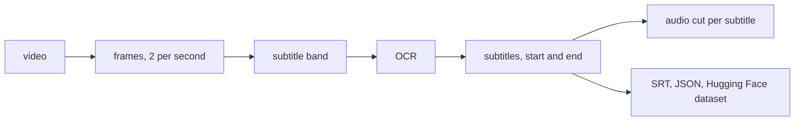

# Frame2Text4LLM

**By Alban Nyantudre and Salif Sawadogo**, for [BurkimbIA](https://huggingface.co/burkimbia).

Many videos carry their translation burned into the picture: a series in Mooré with French
subtitles, a sermon in Dioula subtitled in English. Frame2Text4LLM reads those subtitles with OCR,
finds when each one starts and ends, and cuts the audio underneath. What comes out is a set of
pairs, the speech and the text that goes with it, ready for a speech recognition or speech
translation dataset.



## Install

```bash
pip install "frame2text4llm[easyocr]"
```

The OCR engines are extras, so that you install only the one you use:

| extra | engine | needs |
|---|---|---|
| `easyocr` | EasyOCR | torch |
| `paddle` | PaddleOCR 3.x | paddlepaddle |
| `vlm` | vision-language models (Qwen3-VL, Florence-2, InternVL2) | torch, transformers |
| `openai` | OpenAI vision models | an API key |
| `all` | all of the above | |

Mistral OCR needs only an API key. Audio cuts need [ffmpeg](https://ffmpeg.org/) on the path.

## Where to go next

- [Getting started](getting-started.md): one video, from frames to audio cuts.
- [How it works](guide/pipeline.md): each step and its parameters.
- [Choosing an OCR engine](guide/engines.md): what each engine gets right, measured.
- [A YouTube video to a speech dataset](examples/youtube-dataset.md): the two-pass recipe.

Frame2Text4LLM was written by Alban Nyantudre and Salif Sawadogo for
[BurkimbIA](https://huggingface.co/burkimbia), which builds speech and language tools for the
languages of Burkina Faso. MIT licence.
